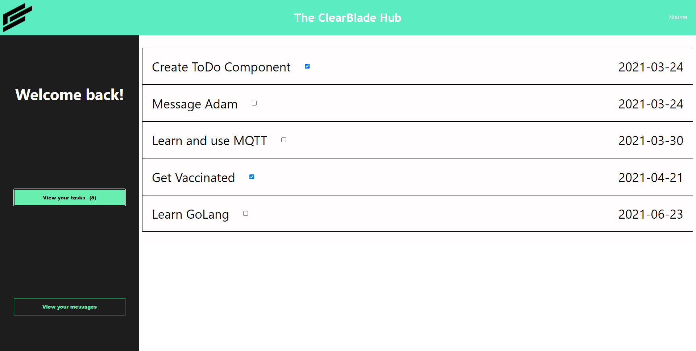
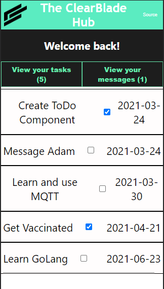
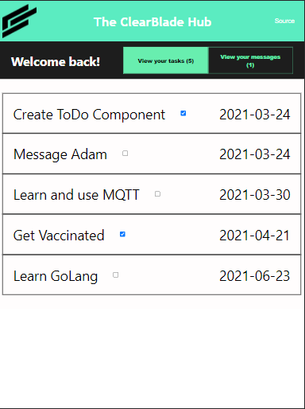

# ClearBlade intern challenge

|  | 
|:--:| 
| *Reminds me I need to take that UI/UX class I've been eyeing soon* |

## Requirements:
- Use React and TypeScript
- Use the ClearBlade JavaScript SDK (npm i --save clearblade-js-client)
- Note that this package incudes a TypeScript definition file that you can use within your
project ( let us know if you have any issues with type definitions)
- Fetch rows from a ClearBlade Collection and display them in the UI
- Allow users to toggle the status of a ToDo with an HTML checkbox
- Update the row in the ClearBlade Collection when a ToDo is toggled in the app

## Takeaways:
- There are edge cases within UI functionality not just input-output functions (ie. realized a user could have a ridicuously long label in to do task, added overflow:auto for a fix)
- A lot of things I should've done better to make cleaner code and to make it less of an eyesore. But it's good to release the MVP and not waste too much time in polishing the unimportant
- The typing in Typescript is super useful! Alias typing cleaned up the code a lot, but oh man the Item API was a bit difficult to figure out with TS's strict typing. Learning moment: if type is unknown by Typescript until run time, just declare it as any instead of forcing it into a Type.

## Breakpoints:
Sample breakpoint demonstration

### Mobile:

### Tablet:

